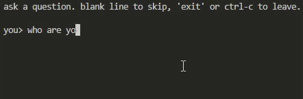
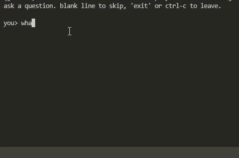

# jev-lm

A character-level language model built out of a classifier.

Jev is a System One model from TypeSafe: it picks one option from a defined set
and returns a calibrated probability over it — the same shape as a
character-level softmax. So the vocabulary becomes 28 Choice options (`a-z`,
space, stopping) and generation is the ordinary autoregressive loop.

```
$ jev-lm --question "what is the capital of france" --seed 1 --verbose
"p"        | stop=0.01 | p=0.27 a=0.22 w=0.20 t=0.12 c=0.11
"pa"       | stop=0.01 | a=0.60 o=0.14 space=0.06 r=0.05 i=0.04
"par"      | stop=0.00 | r=0.88 s=0.04 i=0.03 space=0.01 l=0.01
"pari"     | stop=0.00 | i=0.80 s=0.09 a=0.03 space=0.03 e=0.02
"paris"    | stop=0.00 | s=0.99 space=0.01 h=0.00 p=0.00 w=0.00
"paris."   | stop=0.97 | STOP=0.97 space=0.03 s=0.00 o=0.00 b=0.00
jev> paris.
```

Run it bare for a session:





## Why it works

- **Options are hypotheses, not symbols.** Each option is the text you would
  have if you picked it — `"my name is jev"` — never "the next letter is 'v'".
  Candidates have to differ in *meaning* for a classifier to judge them. This is
  the single largest thing separating a working loop from a broken one.
- **Every request carries the question.** With no target, "which character reads
  most natural" has no answer.
- **Stopping is the 28th option**, its hypothesis being the answer unchanged, so
  ending is drawn from the same distribution as every letter.
- **Each step averages 3 shuffled orderings** in one request, cancelling Jev's
  bias toward whichever option comes first.

## Install

```bash
uv venv
uv pip install -e ".[dev,experiments]"
cp .env.example .env    # then fill in TYPESAFE_API_KEY
```

## Use

```bash
jev-lm                                              # session
jev-lm --question "what is the capital of france"   # answer one and exit
jev-lm --question "largest planet" --beam-width 3
```

| flag | default | |
|---|---|---|
| `--question` | none | answer one and exit; omit for a session |
| `--max-chars` | 60 | character budget |
| `--window` | 40 | how much of the answer each option shows |
| `--ensemble` | 3 | orderings averaged per step; free in requests |
| `--beam-width` | 1 | candidates kept alive; >1 costs a request per beam per step |
| `--length-penalty` | 0.7 | beams rank by `logprob / len ** this` |
| `--seed` | none | reproducible run |
| `--verbose` | off | print the distribution behind every character |

Decoding is greedy, no temperature: a character-level answer cannot recover from
a wrong character.

```python
import random
from jev_lm import build_client, generate

with build_client() as client:
    run = generate(client, "largest planet", random.Random(1), beam_width=3)
```

## Layout

```
src/jev_lm/
  model.py              vocabulary, instructions, state, score_step()
  generation/           generate() dispatch, greedy, beam search
  client.py             build_client()
  cli.py                the jev-lm command and the session
experiments/            the A/Bs, raw results in results/
archive/                what was tried and cut, with the numbers
tests/                  offline
```

## Results

Beam search beats greedy where a locally-attractive character leads nowhere:
spelling *washington*, the space after `"capital was"` scores 0.87 against 0.05
for `h`, and greedy has to take it. On `largest planet` across three seeds:

| arm | correct | requests |
|---|---|---|
| greedy | 2/3 | 8, 8, 4 |
| beam width 3 | 3/3 | 25, 25, 21 |

`archive/README.md` has the rest — the stop-mechanism comparison, why STOP
shaping was dropped, what temperature cost.
